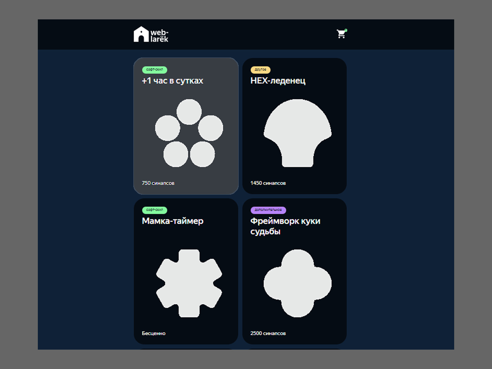

# Проект "Веб-ларек"



Интернет-магазин с товарами для веб-разработчиков. В нём можно посмотреть каталог товаров, добавить товары в корзину и сделать заказ.

Стек: HTML, SCSS, TS, Webpack

Структура проекта:
- src/ — исходные файлы проекта
- src/components/ — папка с JS компонентами
- src/components/base/ — папка с базовым кодом

Важные файлы:
- src/pages/index.html — HTML-файл главной страницы
- src/types/index.ts — файл с типами
- src/index.ts — точка входа приложения
- src/scss/styles.scss — корневой файл стилей
- src/utils/constants.ts — файл с константами
- src/utils/utils.ts — файл с утилитами

## Установка и запуск
Для установки и запуска проекта необходимо выполнить команды

```
npm install
npm run start
```

или

```
yarn
yarn start
```
## Сборка

```
npm run build
```

или

```
yarn build
```


Проект выполнен путем использования паттерна MVP и  имеет три слоя: Presenter, Model и View. Роль слоя Presenter выполнятся файлом index.ts , в котором осуществляется взаимодействие между слоями Model и View. 

## Слой Presenter

Иными словами, назначение слоя **Presenter** - отвечать за управление событиями, эмитируемыми классом EventEmitter (файл events.ts), используя данные двух других слоев.

## Брокер событий

Эмитирует события, на которые реагируют подписчики слоя Presenter.
Имеет несолько методов. В приложении же используется тольк метод `on(eventName: EventName, callback: (event: T) => void)` - устанавливает  обработчик.
## Слой Model
  Слой **Model** (будет представлен файлами **Model.ts**, **AppData.ts**). Назначение слоя - получение и работа с данными пользователя путем ввода в форму, а также с данными приложения, полученными им от сервера. 
 
 ### Файл Model.ts - базовый класс
 #### 🎸class Model (базовый класс)
 Класс  **Model** - публикует событие об изменении модели, чтобы все подписчики обновились.

 ### Файл AppData.ts
 #### 🎸 class AppState 
 Расширяет класс **Model**, имеет интерфейс IAppState (описывает состояние приложения).
 Является фактическим менеджером состояний приложения.
 
 Имеет поля:
 `catalog: IItemData[] `- массив объектов товара,
  `order: IOrder = {}` - объект, формируемый для отправки на сервер сведений о заказе,
  `preview: string | null` - хранит ID карточки, подлежащей отображению в превью.

Имеет методы:
  `setCatalog(items: IItemData[])` - создает экземпляры полученных  с сервера карточек,
  `setPreview(item: IItemData)` - устанавливает данные конкретной карточки в слой Вью по ее идентификатору.
  `setOnlinePayWay()` - устанавливает значение предпочитаемого пользователем способа оплаты.
  `setOfflinePayWay()` - устанавливает значение предпочитаемого пользователем способа оплаты.
`setOrderField(field: keyof IOrderForm, value: string)` - устанавливает значения полей ввода,
`validateOrder() ` - устанавливает тексты ошибок в случае незаполнения пользователем инпутов (валидирует инпуты).

 
 #### 🎸 class BasketData 
  Расширяет класс **Model**, имеет интерфейс `IBasketData` (описывает данные корзины и  ее методы). Хранит данные корзины в поле `basketArray`, а также работает с ними с помощью собственных методов.

Имеет поле:
  `basketArray: IItemData[]` - массив карточек, добавленных в корзину,
   
   Имеет методы:
   `addToBusket(item: IItemData)` - добавления в массив корзины,
  `removeFromBusket(item: IItemData)` - удаления из массива корзины,
  `clearBasket(): void` - очистки массива корзины,
  `makeSum(): number` - подсчета итоговой стоимости корзины.

   
   ### Файл api.ts
   #### 🎸 abstract class Api
  Базовый класс для работы с сетью. 
  Имеет поля:
  `baseUrl: string` - базовый адрес для обращения приложения к серверу
  `options: RequestInit` - опции , используемые для установи заголовков запроса
Имееет методы:
`handleResponse(response: Response)` - обрабатывает ответ от сервера, преобразует тело ответа в JSON-объект.
 `get(uri: string)` - выполняет GET-запрос к указанному URI, используя базовый URL
`post(uri: string, data: object, method: ApiPostMethods = 'POST')` - выполняет POST-запрос к указанному URI с отправкой данных в теле запроса

### Файл LarekApi.ts
 #### 🎸 class LarekApi 
Расширяет (наследует) класс `Api`. Работает с данными, предоставляемыми сервером.
Имеет свойство: 
  `readonly cdn: string` - URL CDN-сервиса, который будет использоваться для получения URL-адресов.
  
 Имеет методы:
 `getOneItem(id: string): Promise <IItemData>`  - получения одной карточки,
 `getItemList(): Promise<IItemData[]>` - получения списка карточек,
 `orderItems(order: IOrder): Promise <IOrderResult>` - отправки сведений о заказе методом POST.


## Слой View
Назначение **View** состоит в отображении и обработке полученных данных.
### Файл Component.ts

   #### 🎸 abstract class Component<Т>
Базовый компонент. Имеет инструментарий для работы с DOM в дочерних компонентах, а именно методы:
`toggleClass() `- переключения класса (принимает элемент и его новый класс)
`setText()` - установки текста (принимает элемент и устанавливаемый текст)
`setDisabled()` - установки атрибута Disabled (принимает сам элемент и булевое состояние) 
`setHidden()` - скрытия элемента (принимает элемент)
`setVisible() `- показа элемента (принимает элемент)
`setImage() `- установки ссылки на картинку (принимает элемент, ссылку и альт-текст)
`render()` - возвращает корневой DOM-элемент (принимает данные любого типа - опционально)

### Файл Modal.ts
  #### 🎸 class Modal
Класс модального окна.
Имеет защищенные поля:
`closeButton: HTMLButtonElement `- кнопка закрытия,
`сontent: HTMLElement` - содержимое окна.

Имеет методы:
`open()`  - открытия,
`close()`  - закрытия,
`render(data: IModalData): HTMLElement` - принимает контент и возвращает контейнер с ним.


### Файл Form.ts
  #### 🎸 class Form
  Общий родительский класс для обеих форм приложения.
   Наследует класс `Component<IFormState>`.
   
Имеет защищенные свойства:  
 `submit: HTMLButtonElement` - кнопка сабмита,
 `errors: HTMLElement` - элемент, выводящий сведения об ошибке валидации.
Контейнер имеет слушатели ввода в инпут и оправки формы.

Имеет методы:
`onInputChange(field: keyof T, value: string)`  - для эмитирования событий.
`render(state: Partial<T> & IFormState) `- для рендеригна состояний формы.

### Файл CatalogPage.ts
 #### 🎸 class CatalogPage 
 Класс отображения главной страницы.
 Наследует класс `Component<IcatalogPage>`.
 
 Имеет поля:
 `counter: HTMLElement`  - счетчик корзины,
  `catalog: HTMLElement `- контейнер каталога,
 `wrapper: HTMLElement` - контейнер страницы,
 `basket: HTMLElement` - кнопка корзины.

Имеет сеттеры полей:
  `set counter(value: number)` - устанавливает значение счетчика на иконке корзины,
  `set catalog(items: HTMLElement[])` - используется для замены всех дочерних элементов указанного родительского элемента новыми элементами.
  `set locked(value: boolean)` - используется для установки статуса блокировки скролла.

### Файл Card.ts
  #### 🎸 class Card 
  Базовый класс для всех типов карточек.
 Наследует класс `Component<IItemData>`.

Имеет свойства:
`category: HTMLElement` - установки категории товара,
`title: HTMLElement `- установки названия,
`image: HTMLImageElement` - установки изображения,
`price: HTMLElement `- установки цены,
`id: string `- установки идентификатора.
  
   #### 🎸 class CatalogItem
  Класс карточки каталога, унаследованный от  `Card`.
  Принимает в конструктор имя блока, контейнер с карточкой и ссылку на коллбек действий с карточкой. На его основе создается экземпляр каждой карточки каталога. 
  
   #### 🎸 class PreviewItem
Класс карточки для отображения превью в модальном окне, унаследованный от  Card.
Поля:
`description: HTMLElement `- описание товара,
`buyButton: HTMLButtonElement `- кнопка покупки.

Методы:
`markPriceless() `- изменяет текст кнопки на "Недоступно для приобретения" и делает ее неактивной,
`markAdded()` - изменяет текст кнопки на "Уже в корзине" и делает ее неактивной.

   #### 🎸 class ShortItem
  Класс карточки корзины. 
  Расширяет класс `Component<IItemData>`.
  Поля:
 ` itemIndex: HTMLElement` - номер позиции в корзине,
 ` title: HTMLElement` - заголовок,
  `price: HTMLElement` - цена, 
  `basketDeleteButton: HTMLButtonElement` - кнопка удаления из корзины, слушающая клик по ней.  

### Файл DeliveryForm.ts
  #### 🎸 class  DeliveryForm 
  Класс формы выбора способа оплаты и ввода адреса.
  Наследует класс `Form<IDeliveryForm>`.
  Имеет поля:
`payCard: HTMLButtonElement `- кнопка выбора способа оплаты картой,
`payCash: HTMLButtonElement `- кнопка выбора способа оплаты при получении,
 `address: HTMLInputElement `- инпут ввода адреса.

Имеет методы:
  `makePayByCardActive(value: boolean) `- устанавливает кнопку оплаты картой в активное состояние, принимает булевое значение.
`makePayByCashActive(value: boolean)` - устанавливает кнопку оплаты при получении в активное состояние, принимает булевое значение.
Методы не объединены в общий (не создан метод вроде `makeButtonActiv()`) намеренно - для улучшения последующей читаемости кода, в котором методы будут применяться. 

### Файл ContactsForm.ts
  #### 🎸 class ContactsForm
Класс формы ввода контактный данных.
Наследует класс `Form<IOrderForm>`.

 Имеет поля:
 `phone: string` - инпут ввода номера телефона,
 `email: string `- инпут ввода адреса электронной почты.

### Файл Basket.ts
  #### 🎸 class  Basket
 Класс, определяющий свойства темплейта всей корзины, наследует `Component<IBasket>`.
 Имеет поля:
 `ul: HTMLElement` - используется для замены всех дочерних элементов указанного родительского элемента новыми элементами.
  `orderButton: HTMLButtonElement` - кнопка заказа.
  `basketCounter: HTMLElement` - счетчик стоимости содержимого корзины.
  
### Файл SuccessPage.ts
  #### 🎸 class  SuccessPage
  Класс компонента успешной покупки.
 Расширяет класс `Component<ISuccessPage>`
   Имеет  защищенные поля:
  `counter: HTMLElement` - устанавливает значение счетчика,
  `lastButton: HTMLButtonElement` - кнопка "Сделать новый заказ".

# Интерфейсы

```ts
/**интерфейс заказа  */
export interface IOrder {
  payment: "online" | "offline";
  email: string;
  phone: string;
  address: string;
  total: number;
  items: string[];
}
/**интерфейс состояния всего приложения  */
export interface IAppState {
  catalog: IItemData[];
  order: IOrder | null;
  preview: string | null;
}

/**интерфейс состояния корзины  */
export interface IBasketData {
  basketArray: IItemData[];
}

/**интерфейс ответа сервера на сделанный заказ */
export interface IOrderResult {
  id: string;
  total: number;
}

/**интерфейс данных товара */
export interface IItemData {
  id?: string;
  description?: string;
  image?: string;
  title: string;
  category?: string;
  price: number | null;
  itemIndex?: number;
}

/**интерфейс для каталога */
export interface IcatalogPage {
  counter: number;
  catalog: HTMLElement[];
  wrapper: HTMLElement;
  basket: HTMLElement;
  locked: boolean;
}

/**общий интерфейс действий для всех типов карточек */
export interface ICardActions {
  onClick: (event: MouseEvent) => void;
}

/**интерфейс карточки превью  */
export interface IPreviewItem {
  description: HTMLElement;
  buyButton: HTMLButtonElement;
}

/**интерфейс действий в корзине */
export interface IBasketActions {
  onClick: (event: MouseEvent) => void;
}
/**интерфейс корзины */
export interface IBasket {
  ul: HTMLElement[];
  counter: number;
}

/**интерфейс модального окна */
export interface IModalData {
  content: HTMLElement;
}

/**интерфейс страницы успеха */
export interface ISuccessPage {
  onClick: (event: MouseEvent) => void;
}

/** потенициальные ошибки валидации формы */
export type FormErrors = Partial<Record<keyof IOrder, string>>;

/** состояние формы */ 
export interface IFormState {
  valid: boolean;
  errors: string[];
}

/** интерфейс формы контактов*/
export interface IOrderForm {
  email: string;
  phone: string;  
}

/** интерфейс формы с адресом и способом оплаты */
export interface IDeliveryForm {
  payCard: string;
  payCash: string;  
  address: string;
  payment: string;
}

```
